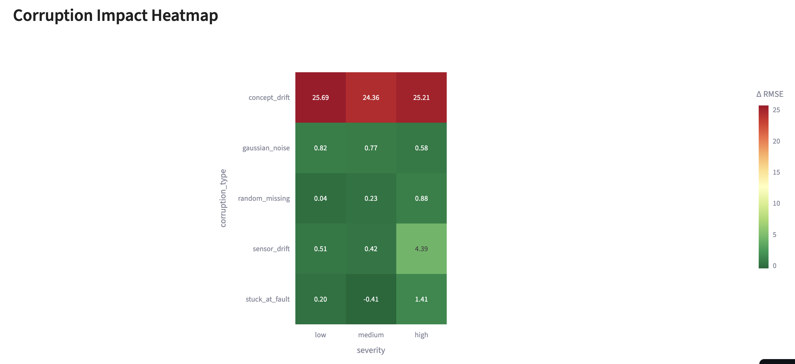
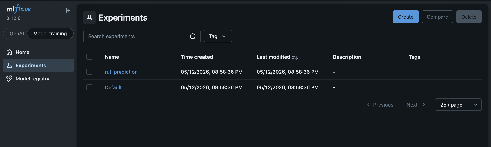
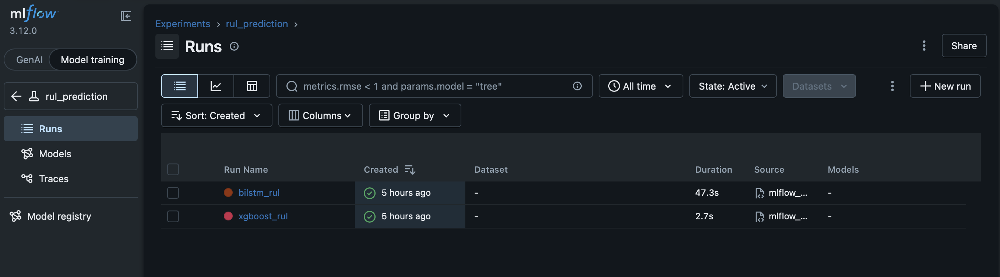
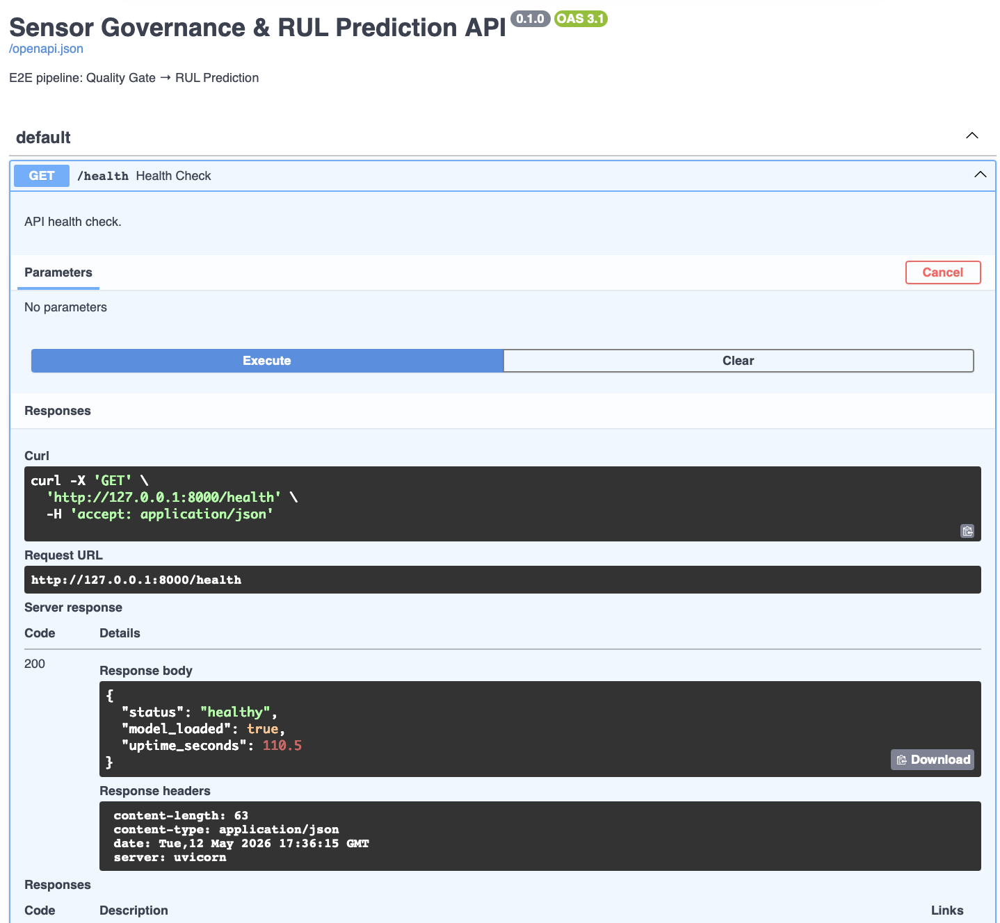

# Industrial Sensor Governance & Predictive Maintenance Platform

**센서 데이터를 신뢰할 수 없는 상황에서, 예지정비 모델의 예측을 신뢰할 수 있는가?**

대부분의 예지정비 프로젝트는 센서 데이터가 정상이라는 전제 위에서 RUL(잔여수명) 모델을 만든다. 이 프로젝트는 그 전제를 의심하는 데서 출발한다. 5가지 데이터 오염을 의도적으로 주입하고, 거버넌스 레이어가 피해를 얼마나 회복하는지를 정량화한다.

**Dashboard:** [sensor-governance-platform.streamlit.app](https://sensor-governance-platform.streamlit.app/)


## Architecture

```
Raw Sensor Data (C-MAPSS FD001-FD004)
        |
  +-----+------+
  | LAYER 1    |  Data Quality Governance
  | Governance |  Completeness / PSI / Cross-sensor Correlation
  |            |  -> Sensor Health Score -> Quality Gate (PASS/FLAG/BLOCK)
  |            |  -> Corruption Experiment (5 types x 3 severities = 15 scenarios)
  +-----+------+
        |
  +-----+------+
  | LAYER 2    |
  | 2A Anomaly |  IF (AUROC 0.955) > AT (0.894) -- 3-way evaluation
  | 2B RUL     |  TFT (RMSE 16.39) > XGBoost (18.81) > Bi-LSTM (20.11)
  |            |  + SHAP / Variable Importance / MC Dropout UQ
  +-----+------+
        |
  +-----+------+
  | LAYER 3    |  MLOps Platform
  | Platform   |  MLflow + DVC + FastAPI + Streamlit
  |            |  + Monitoring (drift detection -> retrain trigger)
  |            |  + Model Card auto-generation
  +------------+
```


## Key Differentiator: Corruption Experiment

5가지 데이터 오염 x 3단계 심각도 = 15개 시나리오. 거버넌스 전략이 없으면 최대 RMSE 2.4배 악화. **5회 반복 진화**를 통해 v1의 -1,488% 역효과 -> 최종 0/15 역효과를 달성.



### Strategy Evolution (5 iterations)

| Version | Change | Positive | Neutral | Negative | Key Issue |
|---|---|---|---|---|---|
| v1 | Forward fill all sensors | 0 | 9 | **6** | NaN에만 작동, drift/noise 무효 |
| v2 | Type-aware strategy | - | - | - | sensor_drop -> RMSE 42.76 폭발 (14개 전부 제거) |
| v3 | N_CORRUPT_SENSORS=4 | 5 | 1 | **5** | Low severity: drop 비용 > 피해 |
| v3+ | PSI severity gate (>0.2) | 4 | 7 | **1** | stuck-at: PSI로 탐지 불가 |
| **Final** | **Stuck-at -> passthrough** | **7** | **8** | **0** | **Variance 탐지 시도 -> 실패 -> passthrough 전환** |

### Final Remediation Mapping

| Corruption Type | Strategy | Recovery | Rationale |
|---|---|---|---|
| Concept Drift | Retrain Alert | **100%** (3/3) | Cannot fix data -- detect and trigger retraining |
| Gaussian Noise | Smoothing | **72-79%** | Rolling mean suppresses noise, preserves trend |
| Sensor Drift | Smart Sensor Drop | **80.1%** (high only) | PSI > 0.2 sensors dropped; mild ones kept |
| Random Missing | Passthrough | 0% (safe) | XGBoost native NaN handling outperforms imputation |
| Stuck-at Fault | Passthrough | 0% (safe) | Normal-range fixed values -- PSI/variance both unreliable |

> **Core principle:** Governance is not "always intervene." Compare intervention cost vs damage. Only act when detection confidence is high AND benefit exceeds cost. Passthrough (0%) is a clear improvement over v1's -1,488%.


## Results

### Anomaly Detection (Layer 2A) -- 3-Way Evaluation

| Model | AUROC | Point F1 | Range F1 | Event F1 | Type |
|---|---|---|---|---|---|
| Rolling Z-score | 0.327 | 0.456 | 0.307 | 0.298 | Statistical |
| **Isolation Forest** | **0.955** | **0.789** | **0.594** | **0.564** | ML (2008) |
| Anomaly Transformer | 0.894 | 0.052 | - | - | DL SOTA (ICLR 2022) |

IF wins across all three evaluation frameworks, confirming the result is not method-dependent.

**USAD intentionally skipped:** Z-score -> IF already established "why ML is needed." IF vs AT is a more insightful comparison than a 3-way with USAD adding no new narrative.

**AT learning journey (4 attempts):** NaN explosion (log(0) in KL) -> disc stagnation (minimax canceling) -> epoch instability (AUROC oscillating) -> model capacity increase (d_model 64->128, lr 5e-5) -> AUROC 0.894.

### RUL Prediction (Layer 2B)

| Model | Test RMSE | NASA Score | Type |
|---|---|---|---|
| XGBoost | 18.81 | 914 | Tabular ML |
| Bi-LSTM | 20.11 | 611 | DL (LSTM) |
| **TFT (best)** | **16.39** | **482** | DL (Transformer) |
| TFT (worst) | 41.82 | 18,153 | Same hyperparameters |

**TFT instability:** 5 runs, identical params -> RMSE 16-42. Discovered argparse defaults override function defaults when running with `python -m`. VSN winner-take-all on small datasets: Run 3 sensor_14 at 72% vs Run 2's balanced distribution.

**SHAP vs TFT importance -- Top-5 overlap 3/5:** sensor_4, sensor_11, sensor_15 are consensus priority sensors (two independent methods agree).

**MC Dropout UQ:** Coverage 0.42-0.56 (target 0.90). Over-confident -- captures epistemic uncertainty only. Conformal Prediction needed for proper calibration.

### Cross-Subset Transfer

| Transfer | RMSE | Delta | Meaning |
|---|---|---|---|
| FD001 -> FD001 | 18.81 | baseline | Same plant |
| FD001 -> FD003 | 21.84 | **+16%** | New fault type |
| FD001 -> FD002 | 53.99 | **+187%** | New operating conditions |
| FD001 -> FD004 | 54.95 | +192% | Both changed |

**Operating condition change (+187%) dominates fault type change (+16%).** FD002 ~ FD004 confirms conditions account for ~97% of transfer failure.

### Full Subset Benchmark (independently trained)

| Subset | Conditions | Faults | XGBoost RMSE | IF AUROC |
|---|---|---|---|---|
| FD001 | 1 | 1 | 18.81 | 0.955 |
| FD002 | 6 | 1 | 42.34 | 0.954 |
| FD003 | 1 | 2 | 17.81 | 0.953 |
| FD004 | 6 | 2 | 50.07 | 0.947 |

**IF stable across all subsets (0.947-0.955).** RUL splits sharply by condition: single 18.31 vs multi 46.20 (+152%).

### Cross-Stage Integration

| Experiment | Result | Finding |
|---|---|---|
| IF score -> RUL feature | RMSE +0.046 (failed) | Same source, same signal -- information redundancy |
| TFT importance -> targeted corruption | Noise 5.3x (success) | Importance predicts noise sensitivity, not drift sensitivity |


## ML Platform (Layer 3)

### MLflow




SQLite backend. Apple Silicon: `OMP_NUM_THREADS=1` required (libomp conflict). `mlflow.sklearn.log_model()` segfaults on M2 -- pickle artifact workaround.

### FastAPI



Quality Gate -> RUL prediction E2E. Response includes predicted RUL + data quality score + confidence.

### Monitoring

PSI drift detection per sensor. FD001 vs FD002: 15 critical alerts, automatic retrain trigger. Consistent with transfer experiment.

### Model Card

Auto-generated for all 3 models. Includes limitations, failure modes, recommended scope, governance requirements.

### DVC

`.gitignore` required `data/raw/CMAPSSData/` (not `data/raw/`) to avoid blocking `.dvc` files.


## Dataset

NASA C-MAPSS -- 4 subsets, 21 sensors, 508 engines total.

| Subset | Train/Test | Conditions | Faults | Role |
|---|---|---|---|---|
| FD001 | 100/100 | 1 | 1 | Primary (all experiments) |
| FD002 | 260/259 | 6 | 1 | Transfer + benchmark |
| FD003 | 100/100 | 1 | 2 | Transfer + benchmark |
| FD004 | 248/249 | 6 | 2 | Transfer + benchmark |


## Quick Start

### Dashboard
[sensor-governance-platform.streamlit.app](https://sensor-governance-platform.streamlit.app/)

### Local
```bash
git clone https://github.com/ChangyeolAidenOh/sensor-governance-platform.git
cd sensor-governance-platform
python -m venv .venv && source .venv/bin/activate
pip install -r requirements_dev.txt && pip install -e .

# Experiments
python -m core_pipeline.data.preprocess --subset FD001
python -m experiments.run_corruption_experiment_v2
python -m core_pipeline.anomaly.extended_evaluation --subset FD001
python -m experiments.run_cross_subset_transfer
python -m experiments.run_full_benchmark
python -m experiments.shap_analysis --subset FD001
python -m experiments.uncertainty_quantification --subset FD001

# Platform
OMP_NUM_THREADS=1 python -m core_pipeline.platform.mlflow_tracker
python -m core_pipeline.platform.model_card
python -m core_pipeline.platform.monitoring
uvicorn core_pipeline.platform.api:app --port 8000
streamlit run dashboard/app.py
```

> **Apple Silicon (M2/M3):** `OMP_NUM_THREADS=1` required for MLflow + XGBoost.


## Project Structure

```
sensor-governance-platform/
|-- core_pipeline/
|   |-- data/preprocess.py
|   |-- governance/{quality_metrics, quality_gate, corruption}.py
|   |-- anomaly/{isolation_forest, rolling_zscore, anomaly_transformer, extended_evaluation}.py
|   |-- rul/{xgboost_rul, bilstm_rul, tft_rul}.py
|   |-- platform/{mlflow_tracker, api, monitoring, model_card}.py
|-- experiments/
|   |-- run_corruption_experiment_v2.py
|   |-- run_cross_stage_experiments.py
|   |-- run_cross_subset_transfer.py
|   |-- run_full_benchmark.py
|   |-- shap_analysis.py
|   |-- uncertainty_quantification.py
|-- dashboard/app.py
|-- dvc.yaml
|-- docker-compose.yml
```


## Key Principles

1. **Governance ≠ always intervene.** v1's -1,488% -> final 0/15 negative.
2. **SOTA ≠ optimal.** IF (2008) > AT (2022) on gradual degradation.
3. **Variable Importance has scope limits.** Noise sensitivity (5.3x) yes, drift sensitivity (1.0x) no. SHAP/TFT agree on 3/5 sensors.
4. **Failed experiments have value.** IF->RUL redundancy. MC Dropout coverage 0.56.
5. **TFT instability is structural.** RMSE 16-42. Multi-seed ensemble required.
6. **Operating conditions dominate transfer.** +187% vs +16%. IF stable (0.947-0.955).
7. **Corruption and transfer express one principle.** Distribution shift breaks models. Detect with PSI, retrain.


